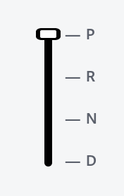

# Gearbox Widget

An application to emulate a gearbox sending messages to the
Vehicle HAL of a guest Android Auomotive OS through a socket.

<div align="center">
    
</div>

# Running the application

1 - Install Rust using rustup <https://rustup.rs/>

2 - Run the application

```shell
cargo run
```
